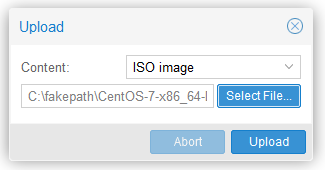
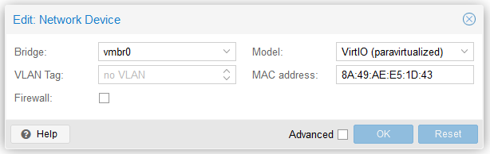
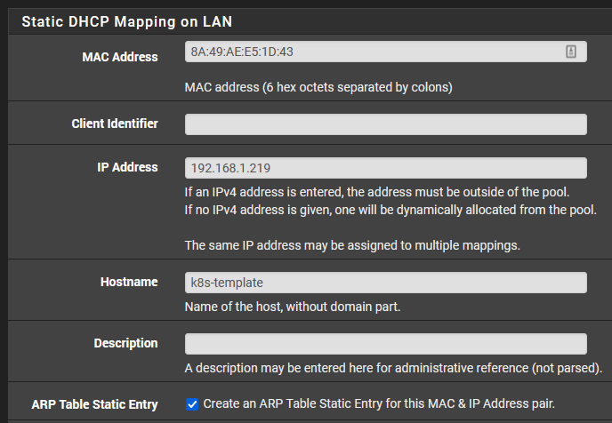
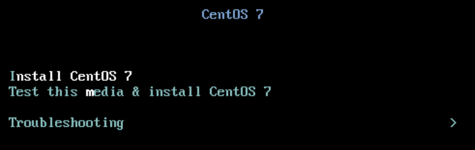
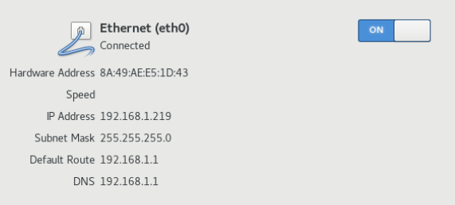

# Kubernetes Home Lab

## Technologies
1. [pfSense][pfsense-download] - an open-source firewall and routing platform
2. [Proxmox VE][proxmox-download] - an open-source platform for enterprise virtualization
3. [CentOS 7][centos-download] - an open-source, community-driven Linux distribution derived from RHEL
4. [Ubuntu Server][ubuntu-download] - a Linux distribution based on Debian and composed mostly of free and open-source software

## Overview

For this lab, I'm using Proxmox as a hypervisor to create VMs.
Here is a breakdown of the VMs.

|       Machine       |  Type  |  CPU   |  RAM   | Storage |  IP Address   |
|:-------------------:|:------:|:-------------:|:------:|:------:|:-------:|
| k8s-control-plane-1 | Master |   4    |   8    |   32    | 192.168.1.200 |
|    k8s-compute-1    | Worker |   4    |   8    |   32    | 192.168.1.204 |
|    k8s-compute-2    | Worker |   4    |   8    |   32    | 192.168.1.205 |

## Prerequisites
1. Upload the ISO to Proxmox storage

    

## Setup Kubernetes Template VM
1. In Proxmox, create a VM
2. Give the new VM a name of `k8s-template`
3. Select the ISO image uploaded earlier as the OS
4. Enable the Qemu Agent
5. Set the Disk size to 32GiB
6. Set the Cores to 4
7. Set the Memory to 8192MiB
8. Don't start after created

## Setup DHCP
1. In Proxmox, select the new k8s-template VM
2. Select `Hardware`
3. Copy the Network Device MAC address

   
   
4. In pfSense, select `Services -> DHCP Server`
5. At the bottom, click `Add` to add a DHCP Static Mapping
6. Enter the MAC Address, IP Address, and Hostname

   

## Install CentOS 7 on VM 
1. Start the VM
2. Select `Install CentOS 7`

   

3. Update `Software Selection` to a Compute Node and add additional Add-Ons

   

4. Update `Network & Host Name` to turn on the Ethernet connection
   
   We can confirm that the IP Address is the same as the IP Address we setup in pfSense  

   

5. Begin Installation
6. Set `Root Password` and create your user
7. Reboot once installation has completed

## Setup Kubernetes Requirements
1. Login to the VM and run this script

   ```shell
   curl -s https://raw.githubusercontent.com/pstickney/homelab/master/setup.sh | bash
   ```

## Create Kubernetes Control Plane
1. On the control plane node
2. Pull the latest kubeadm images

   ```shell
   sudo kubeadm config images pull
   ```
3. Initialize control plane

   ```shell
   sudo kubeadm init --pod-network-cidr=10.244.0.0/16 --service-cidr=10.246.0.0/16 \
          --control-plane-endpoint=192.168.1.200 --apiserver-advertise-address=192.168.1.200
   ```

## Copy ~/.kube/config
```shell
mkdir -p $HOME/.kube
sudo cp -i /etc/kubernetes/admin.conf $HOME/.kube/config
sudo chown -R $(id -u):$(id -g) $HOME/.kube
```

## Install CNI
Install the Flannel CNI

```shell
kubectl apply -f https://raw.githubusercontent.com/flannel-io/flannel/master/Documentation/kube-flannel.yml
```

## Join Worker Nodes

Use the join command that the call to `kubeadm init` provided to join the remaining 
worker nodes to the cluster.

```shell
sudo kubeadm join 192.168.1.200:6443 --token <token> --discovery-token-ca-cert-hash sha256:<hash>
```


[pfsense-download]: https://www.pfsense.org/download/
[proxmox-download]: https://www.proxmox.com/en/downloads/category/iso-images-pve
[centos-download]: https://www.centos.org/download/
[ubuntu-download]: https://ubuntu.com/download/server
